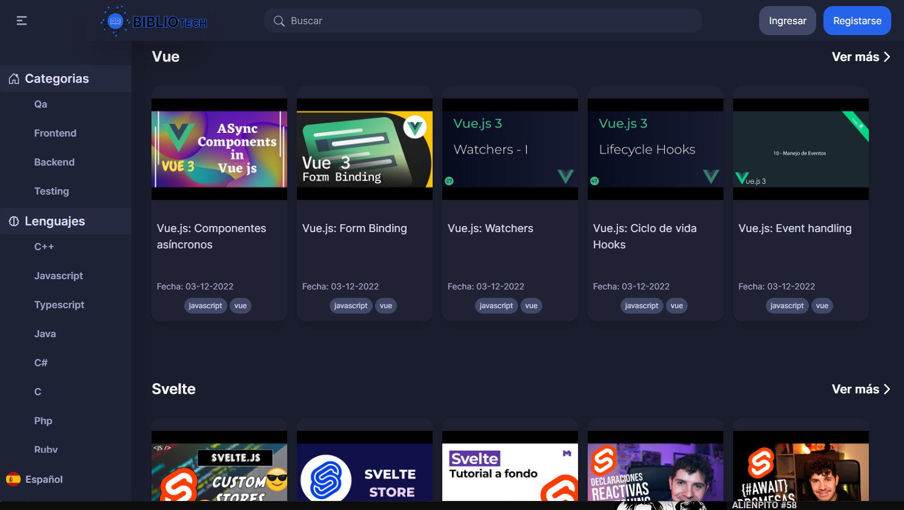

# C8-40-M-MERN - Developers Library Proyect for No-Country

Platform to access different types of resources (videos, documents and images) related to programming. 
The project was designed so that developers have a platform to looking for technologies documents (react, express, etc) or solve technical problems. 
The platform would provide benefits since it brings together resources from multiple sources, the resources would be verified and updated,
and the platform would have filtering search.

## Frontend

- Console in client, then: `npm install`
- Start server: `npm start`

`http://localhost:3000` 

## Backend

- Console in server, then: `npm install`
- Start Back: `npm run dev`

`http://localhost:3001/api/`

## Contributors

- Carlos Diaz - https://github.com/Carlos13-Lab
- Gabriel Quinteros - https://github.com/cod3-Sh4rk
- Gustavo Pereira - https://github.com/GAPV-Coder
- Jose Carlos - https://github.com/jcarlosdf
- Martín Cristina Darroux - https://github.com/martincrisdarr
- Martín Otero - https://github.com/C0d3Drak3
- Michel Cruz - https://github.com/Taurien
- Zayra Velasco - https://github.com/zayrarepositor

